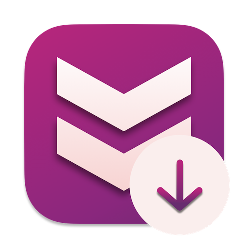
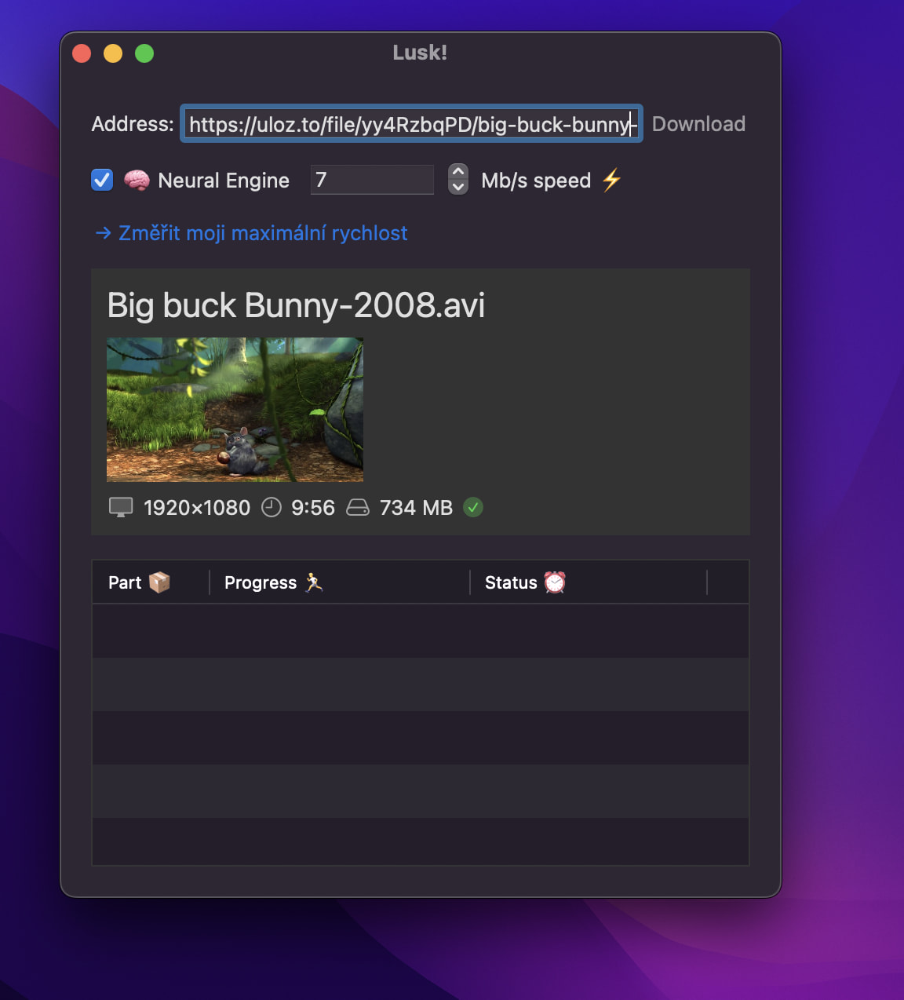
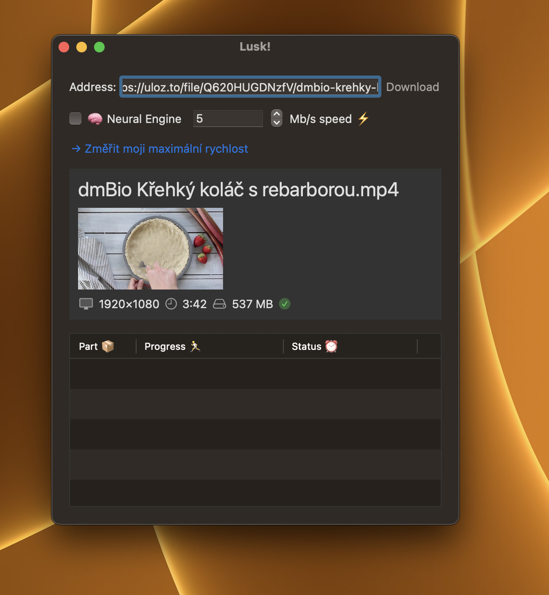

<h1 align="center"> </h1>

<h3 align="center">Lusk!</h3>

    Váš věrný pomocník pro rychlé stahování z Ulož.to 🤌
     
    <strong>Verze: </strong>WIP (Nedokončeno)
     
     
    
    
    
    
     
     
    <a><strong>Žádný soubor ke stažení</strong></a>
     
     
    <a href="https://github.com/EETagent/Lusk/issues">Nahlásit chybu</a>
  

## 🔔 Informace

Lusk je stále ve vývoji, obsah bude průběžně aktualizován

## 🧠 CoreML & Neural Engine

Automatizované (a opravdu rychlé ⚡ lusknutím 🤌 prstu) louskání captcha 😩 přímo na Vašem zařízení!

## 🖼️ Galerie

